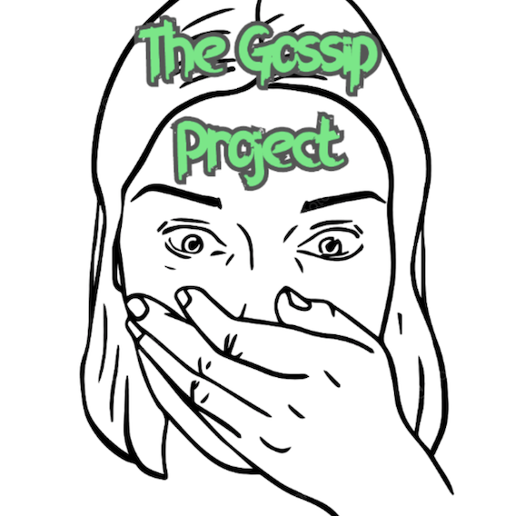

# The Gossip Project - Views v1.0
_l'app putasse_

<div style="text-align:center" align="center">
  
</div>

## Application

Réseau social de partage de potins, créé dans le cadre de The Hacking Project

## Installation

- Installez au préalable les gem  et dépendences.
  ```
  bundle install
  bundle update
  ```
- Configurez la base de donnée
  
  La gestion de la base de données est faite avec Postgres.
  Pour exécuter ce projet en local, créez une clé sur le modèle suivant:

  >username: postgres
  >password: postgres

  Sinon faites les modifications nécessaires dans le fichier `config/database.yml`

  ```yml
  development:
  <<: *default
  database: bairbnb_development
  host: localhost
  username: <<your-user-name>>
  password: <<your-password>>
  ```

- Exécutez le base de donnée sur votre ordinateur
  
  ```bash
  rails db:create #ou rails db:create:all #ou rake db:create:all
  rails db:migrate
  ```
  
 ## Améliorations possibles

- Optimisation graphique

- Génération sexuée des profils aléatoire, photos de profil en accord

- Un peu plus de putasseries

- Glow in the dark mode, et canards qui te suivent tout le temps 🦆🦆🦆

## Contributeurs

- [:bell: Stanislas BASQUIN](https://github.com/StanislasBASQUIN)
- [:dragon_face: Tien Duy NGUYEN](https://github.com/tienduy-nguyen)
- [:city_sunset: Hugo Péran Séjourné](https://github.com/HugoPeranSejourne)
- [:mega: Mathieu JOLY](https://github.com/mathieu-superpose)
- [:santa: Vivien Ploix](https://github.com/Vivien-Ploix)
- [:mortar_board: Chérif BA](https://github.com/barifche)

